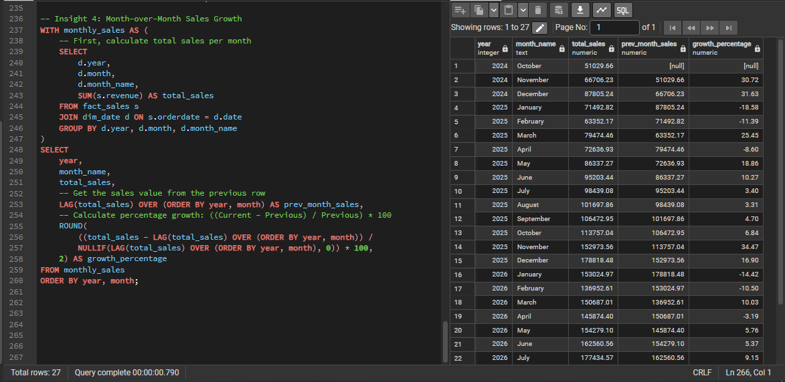
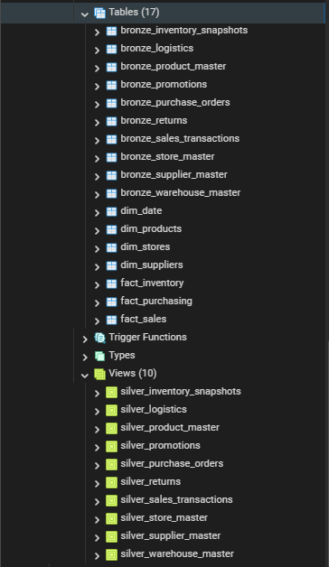

# 🏭 Supply Chain Data Warehouse — Medallion Architecture (Bronze → Silver → Gold)

An end-to-end data engineering & analytics project that transforms 10 raw, messy supply
chain CSV/Excel exports into a clean, query-ready star-schema warehouse — and answers real
stakeholder questions on top of it, including a month-over-month revenue growth trend.

**Stack:** Python (Pandas) · PostgreSQL · SQLAlchemy · pgAdmin4 · SQL (Views, CTAS, Window Functions)


**Sample output — month-over-month revenue growth:**

---

## 📌 Business Problem

A retail supply chain organization tracks products, stores, suppliers, sales, inventory,
purchase orders, returns, promotions, warehouses, and logistics across **10 separate raw
data sources** — but none of it is unified, standardized, or query-ready. Analysts can't
answer basic questions like *"which SKUs are below safety stock?"* or *"is revenue trending
up or down?"* without manually reconciling spreadsheets.

This project builds a governed data warehouse that solves that, following the **Medallion
Architecture** pattern used in modern data engineering (Bronze/Silver/Gold).

---

## 📂 Repository Structure

```
supply-chain-data-warehouse/
│
├── README.md
├── requirements.txt
├── .gitignore                     # excludes raw_data/, .env, credentials
├── .env.example                   # template for DB credentials
│
├── notebooks/
│   └── data_cleaning.ipynb        # Pandas cleaning, Bronze ingestion, dim_date generation
│
├── sql/
│   └── transformations.sql        # Silver views + Gold star schema + stakeholder queries
│
├── docs/
│   └── architecture_diagram.svg   # Bronze/Silver/Gold flow, visualized
│
└── insights/
    └── stakeholder_findings.md    # write-up of the business questions answered
```

---

## 🔧 Pipeline Details

### 1. Bronze Layer — Ingestion
`notebooks/data_cleaning.ipynb`
- Reads 10 raw source files, including `warehouse_master`
- Standardizes column headers (lowercase, whitespace-stripped) to prevent schema
  mismatches downstream
- Loads into PostgreSQL via SQLAlchemy, dropping and recreating each table on every run
  so the pipeline is fully repeatable
- Generates `dim_date` directly in Python (`pd.date_range`) — year, month, quarter, day
  of week, weekend flag — and loads it straight to Postgres
- Runs `sql/transformations.sql` automatically at the end, so one notebook run rebuilds
  the entire warehouse from raw files to Gold tables

### 2. Silver Layer — Cleaning & Standardization
`sql/transformations.sql`
- Built as SQL **views** on top of bronze tables (keeps raw data immutable/auditable)
- Key transformations:
  - `TRIM()` on all text fields to remove leading/trailing whitespace
  - `REPLACE(sku, ' ', '')` to fix inconsistent SKU formatting across sources
  - Explicit type casting: `NUMERIC(10,2)` for currency, `DATE` for dates, `INTEGER` for counts
  - Boolean normalization: string values like `'true'/'1'/'yes'` → proper `BOOLEAN`
  - `SELECT DISTINCT` to remove duplicate records at the source

### 3. Gold Layer — Dimensional Modeling
Star schema with **5 dimensions** and **3 facts**:


- `dim_products`, `dim_stores`, `dim_suppliers`, `dim_warehouses` — one row per business
  key, filtered to exclude blank/null keys before the primary key is enforced
- `dim_date` — generated in Python, joined against every fact table's date column for
  clean year/month/quarter roll-ups without manual date math
- `fact_sales` (grain: invoice × SKU), `fact_inventory` (grain: snapshot date × store × SKU),
  `fact_purchasing` (grain: PO × SKU, enriched with `warehouseid`)
- **Design decision:** every fact table's key (`sku`, `storename`, `suppliername`) is taken
  from the *source* transaction table, not from the dimension table it's `LEFT JOIN`-ed to.
  A sale, inventory count, or purchase order is never dropped or NULL-keyed just because its
  SKU/store/supplier hasn't made it into the master data yet — the LEFT JOIN enriches the
  row, it doesn't gate whether the row survives
- Primary keys enforced at the fact-table level for query performance and integrity

### 4. Stakeholder Insights
| Question | Business Purpose |
|---|---|
| Top 5 products by revenue | Merchandising / assortment planning |
| SKUs below safety stock | Trigger procurement reorder alerts |
| Suppliers ranked by late deliveries | Vendor performance review / sourcing decisions |
| Month-over-month revenue growth | Leadership / finance trend reporting |

Full writeup with the query for each: [`insights/stakeholder_findings.md`](insights/stakeholder_findings.md)

---

## 🚀 How to Reproduce

```bash
# 1. Clone the repo
git clone https://github.com/<your-username>/supply-chain-data-warehouse.git
cd supply-chain-data-warehouse

# 2. Set up environment
pip install -r requirements.txt
cp .env.example .env   # add your PostgreSQL password

# 3. Run the full pipeline: cleaning -> bronze -> dim_date -> silver -> gold
jupyter notebook notebooks/data_cleaning.ipynb
```

---

## 🧠 Key Learnings

- Designed a **medallion architecture from scratch**, separating raw ingestion, cleaning
  logic, and analytics-ready modeling into distinct, auditable layers
- Handled real-world data quality issues: inconsistent SKU formatting, mixed boolean
  representations, blank/null business keys
- Made a deliberate modeling decision to **select fact-table keys from the source side of
  a LEFT JOIN, not the dimension side** — protecting transactions from being silently
  dropped or NULL-keyed just because a SKU/store/supplier hasn't been onboarded into
  master data yet
- Built `dim_date` in Python rather than SQL for full control over calendar attributes,
  then used it across the warehouse for window-function trend analysis (MoM growth)
- Practiced writing idempotent SQL (`CREATE OR REPLACE VIEW`, `DROP TABLE IF EXISTS`) for
  repeatable pipeline runs, and moved database credentials out of source code into
  environment variables

## 🔭 Possible Extensions
- Automated data quality checks (e.g. `dbt` tests or `Great Expectations`) to catch schema
  drift before it hits the Gold layer
- Incorporate `silver_logistics` and `silver_returns` into the fact layer for a fuller
  picture of fulfillment and reverse logistics

---

